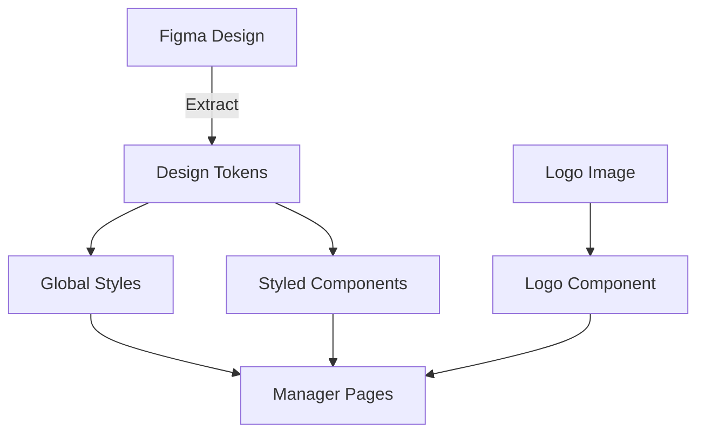
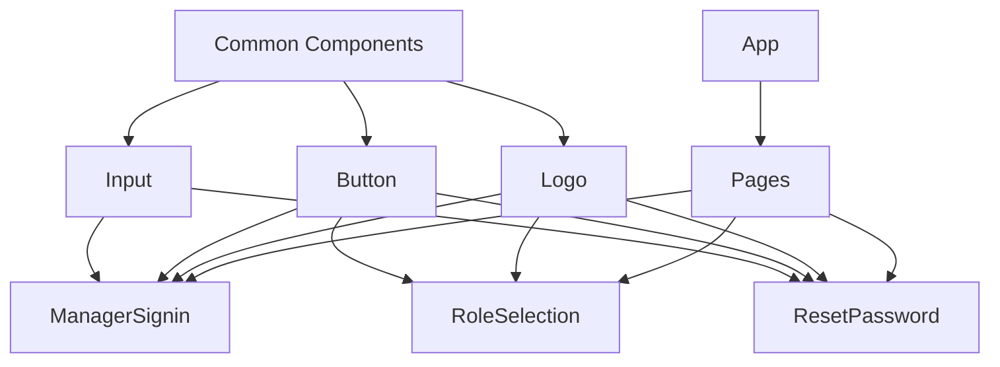

# Design Document

## Overview

This design document outlines the approach for updating the Manager pages (ManagerSignin, ResetPassword, and RoleSelection) to use the actual school logo and apply design variables extracted from the Figma design. The goal is to create a consistent design system that can be applied across all Manager pages and future components.

## Architecture

The design system will be implemented using a combination of:

1. **Design Tokens**: A centralized file containing all design variables extracted from Figma
2. **Styled Components**: For component-specific styling using the design tokens
3. **Global CSS Variables**: For application-wide styling consistency

### Design System Structure

```
src/
├── styles/
│   ├── designTokens.ts     # Design tokens extracted from Figma
│   ├── globalStyles.ts     # Global styles using styled-components
│   └── theme.ts            # Theme provider configuration
├── components/
│   └── common/             # Reusable styled components
│       ├── Button.tsx
│       ├── Input.tsx
│       ├── Logo.tsx        # Logo component with proper image handling
│       └── ...
```

## Components and Interfaces

### 1. Design Tokens

The design tokens will be extracted from Figma using the Figma MCP and organized into the following categories:

```typescript
// src/styles/designTokens.ts
export const colors = {
  // Colors extracted from Figma
  primaryYellow: '#D6B10E',  // Example, will be replaced with Figma values
  secondaryBeige: '#E6D693', // Example, will be replaced with Figma values
  lightBeige: '#F3F1E4',     // Example, will be replaced with Figma values
  textDark: '#333333',       // Example, will be replaced with Figma values
  textLight: '#666666',      // Example, will be replaced with Figma values
  white: '#FFFFFF',          // Example, will be replaced with Figma values
  grayLight: '#E7E7E7',      // Example, will be replaced with Figma values
  errorRed: '#DC3545',       // Example, will be replaced with Figma values
  successGreen: '#28A745',   // Example, will be replaced with Figma values
};

export const typography = {
  // Typography extracted from Figma
  fontFamily: {
    primary: '-apple-system, BlinkMacSystemFont, "Segoe UI", Roboto, Oxygen, Ubuntu, Cantarell, "Fira Sans", "Droid Sans", "Helvetica Neue", sans-serif',
    // Will be replaced with Figma values
  },
  fontSize: {
    // Will be replaced with Figma values
    small: '0.875rem',
    medium: '1rem',
    large: '1.25rem',
    xlarge: '1.5rem',
    xxlarge: '2rem',
  },
  fontWeight: {
    // Will be replaced with Figma values
    regular: 400,
    medium: 500,
    bold: 700,
  },
  lineHeight: {
    // Will be replaced with Figma values
    tight: 1.2,
    normal: 1.5,
    loose: 1.8,
  },
};

export const spacing = {
  // Spacing extracted from Figma
  // Will be replaced with Figma values
  xs: '0.25rem',
  sm: '0.5rem',
  md: '1rem',
  lg: '1.5rem',
  xl: '2rem',
  xxl: '3rem',
};

export const borderRadius = {
  // Border radius extracted from Figma
  // Will be replaced with Figma values
  small: '4px',
  medium: '8px',
  large: '16px',
};

export const shadows = {
  // Shadows extracted from Figma
  // Will be replaced with Figma values
  small: '0 1px 3px rgba(0, 0, 0, 0.1)',
  medium: '0 4px 6px rgba(0, 0, 0, 0.1)',
  large: '0 10px 15px rgba(0, 0, 0, 0.1)',
};
```

### 2. Logo Component

A reusable Logo component will be created to handle the school logo display with proper fallback:

```typescript
// src/components/common/Logo.tsx
import React from 'react';
import styled from 'styled-components';
import { colors, spacing } from '../../styles/designTokens';

interface LogoProps {
  width?: string;
  height?: string;
}

const LogoContainer = styled.div<LogoProps>`
  width: ${props => props.width || '432px'};
  height: ${props => props.height || '155px'};
  display: flex;
  align-items: center;
  justify-content: center;
  background-color: rgba(255, 255, 255, 0.1);
  border-radius: 8px;
  margin-bottom: ${spacing.xl};
`;

const LogoImage = styled.img`
  max-width: 100%;
  max-height: 100%;
  object-fit: contain;
`;

const FallbackText = styled.div`
  color: ${colors.white};
  font-size: 1.2rem;
  font-weight: bold;
`;

const Logo: React.FC<LogoProps> = ({ width, height }) => {
  const [imageError, setImageError] = React.useState(false);

  return (
    <LogoContainer width={width} height={height}>
      {!imageError ? (
        <LogoImage 
          src="/logo-page.png" 
          alt="Genius Smart App Logo" 
          onError={() => setImageError(true)}
        />
      ) : (
        <FallbackText>Genius Smart App</FallbackText>
      )}
    </LogoContainer>
  );
};

export default Logo;
```

### 3. Common Styled Components

Reusable styled components will be created based on the Figma design:

```typescript
// src/components/common/Button.tsx
import styled from 'styled-components';
import { colors, typography, spacing, borderRadius } from '../../styles/designTokens';

interface ButtonProps {
  variant?: 'primary' | 'secondary';
  fullWidth?: boolean;
}

const Button = styled.button<ButtonProps>`
  padding: ${spacing.md} ${spacing.xl};
  background-color: ${props => props.variant === 'secondary' ? 'transparent' : colors.primaryYellow};
  color: ${props => props.variant === 'secondary' ? colors.primaryYellow : colors.white};
  border: ${props => props.variant === 'secondary' ? `1px solid ${colors.primaryYellow}` : 'none'};
  border-radius: ${borderRadius.small};
  font-size: ${typography.fontSize.medium};
  font-weight: ${typography.fontWeight.medium};
  cursor: pointer;
  transition: all 0.2s ease;
  width: ${props => props.fullWidth ? '100%' : 'auto'};
  
  &:hover {
    background-color: ${props => props.variant === 'secondary' ? colors.primaryYellow : '#c4a00d'};
    color: ${props => props.variant === 'secondary' ? colors.white : colors.white};
    transform: translateY(-1px);
  }
  
  &:disabled {
    background-color: ${colors.grayLight};
    border-color: ${colors.grayLight};
    color: ${colors.textLight};
    cursor: not-allowed;
    transform: none;
  }
`;

export default Button;
```

## Data Models

The design system will not introduce new data models but will reference the following existing interfaces:

```typescript
// Existing form data interfaces
interface SigninFormData {
  email: string;
  password: string;
  rememberMe?: boolean;
}

interface EmailFormData {
  email: string;
}

interface OtpFormData {
  otp: string;
}

interface PasswordFormData {
  password: string;
  confirmPassword: string;
}
```

## Error Handling

The design system will handle the following error scenarios:

1. **Logo Image Loading Failure**: Display fallback text when the logo image fails to load
2. **Figma Design Token Extraction Failure**: Use default values as a fallback
3. **Responsive Design Issues**: Implement media queries to handle different screen sizes

## Testing Strategy

The design system will be tested using the following approaches:

1. **Visual Testing**: Manual verification that components match Figma designs
2. **Responsive Testing**: Test on different screen sizes to ensure proper responsiveness
3. **Cross-Browser Testing**: Verify consistent appearance across supported browsers
4. **Accessibility Testing**: Ensure color contrast and other accessibility requirements are met

## Implementation Plan

1. Extract design tokens from Figma using Figma MCP
2. Create the design tokens file with extracted values
3. Implement the Logo component with proper image handling
4. Create reusable styled components based on the design tokens
5. Update the Manager pages to use the new components and design tokens
6. Test the implementation across different devices and browsers

## Diagrams

### Design System Architecture



### Component Hierarchy

